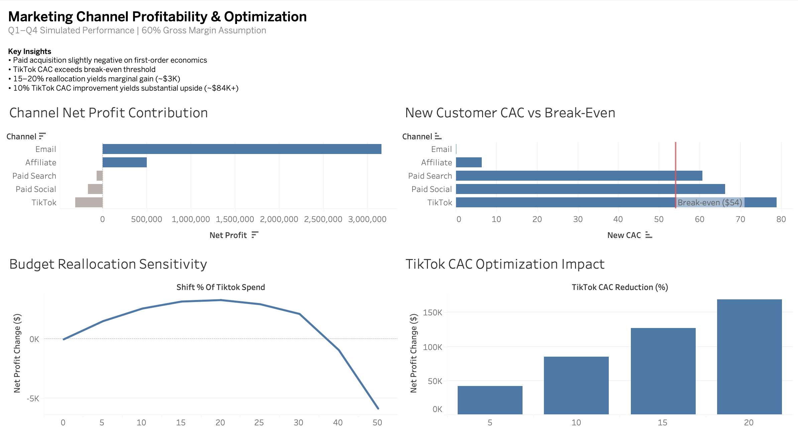

# Marketing Profitability & Capital Allocation Analysis

## Overview
This project evaluates how a direct-to-consumer fitness apparel brand should allocate marketing spend to maximize profitability.

The analysis focuses on first-order contribution margin, customer acquisition cost (CAC) thresholds, and the economic tradeoffs between reallocating budget across channels versus improving channel efficiency.

## Business Question
If multiple acquisition channels are operating near break-even on first purchase:

- Should capital be reallocated between channels?
- Or is improving efficiency within underperforming channels a higher-leverage strategy?

## Data
A 365-day synthetic multi-channel marketing dataset was generated to simulate realistic DTC performance patterns.

**Channels included:**
- Paid Search
- Paid Social
- TikTok
- Affiliate
- Email

**Tracked metrics:**
- Spend
- Revenue
- Purchases
- New vs Returning customers
- Click-through and conversion rates

## Key Assumptions
To isolate profitability mechanics, the following assumptions were used:

- Average Order Value ≈ $90  
- Gross Margin = 60%  
- Break-even CAC = $54 (AOV × Margin)  
- Affiliate commission modeled at 12% of revenue  
- Paid Search efficiency declines when scaled (diminishing returns)

These assumptions are explicit and adjustable. The conclusions depend on them, but the framework remains consistent.

## Methodology

### 1) SQL
- Aggregated channel-level revenue, spend, and purchases  
- Calculated new customer CAC by channel  
- Structured dataset for modeling  

### 2) Python
- Modeled margin-adjusted net profit  
- Simulated budget reallocation from TikTok to Paid Search  
- Incorporated diminishing returns for scaled spend  
- Built CAC improvement scenarios  
- Performed sensitivity analysis across multiple allocation levels  

### 3) Tableau
Developed an executive dashboard highlighting:

- Channel net profit contribution  
- CAC vs break-even comparison  
- Reallocation sensitivity curve  
- Impact of CAC efficiency improvements  

## Key Findings
- Most paid acquisition channels were slightly negative on first-order contribution margin.
- TikTok CAC materially exceeded the break-even threshold.
- Reallocating 15–20% of TikTok spend produced only modest annual profit improvement (~$3K).
- Improving TikTok CAC by 10% increased annual profit by approximately $84K.
- Structural efficiency improvements created significantly greater upside than simple capital reallocation.

## Strategic Insight
Marketing spend functions as invested capital.

Reallocating capital between similarly performing channels produces limited marginal gains. Improving structural inefficiencies within underperforming channels creates materially higher returns.

The framework used here can be applied beyond marketing — any business decision involving capital deployment under margin constraints follows similar logic.

## Future Enhancements
- Incorporate customer lifetime value modeling  
- Analyze retention and cohort behavior by acquisition channel  
- Stress test multiple gross margin scenarios  
- Model blended CAC under different growth targets  

## Tools
- Python
- SQL (SQLite)
- Tableau

## Dashboard Preview

This project demonstrates end-to-end analytical workflow: data generation, aggregation, economic modeling, scenario simulation, and executive visualization.
